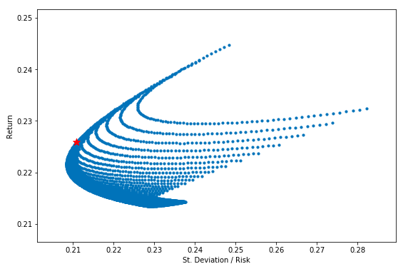

# Portfolio Diversification
This code describes the process of building equity investment portfolio by maximizing Sharpe ratio. It includes 2 approaches to build such portfolio: looping every combination of equity's weight in portfolio and solving optimization problem using scipy.optimize library.

