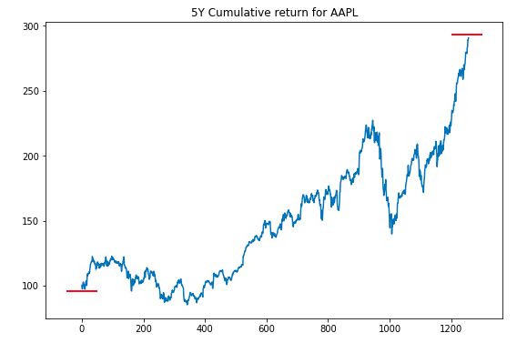
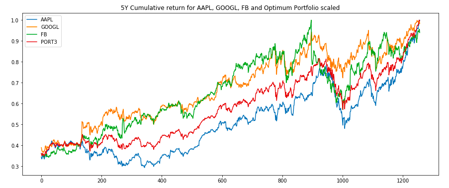

# Portfolio Diversification
This code describes the process of building equity investment portfolio by maximizing Sharpe ratio. It includes 2 approaches to build such portfolio: looping every combination of equity's weight in portfolio and solving optimization problem using scipy.optimize library.

## Terms
To estimate return and risk I used 5Y cumulative return: 

and max drawdown:

## Portfolio vs Stock Picking
Let's assume that you had $10,000 back to 2015 and you wanted to invest it with highest return. You could invest it in the big it companies like Apple, Google or Facebook, Or you could build a portfolio from this 3 equities to improve risk-return ratio.

Risk and return will look like:

As you can see return ($17 576.32) is higher than return in GOOGL or FB, not AAPL. On the other hand max drawdown (-42.84%) is lower than max drawdown for AAPL and FB, not GOOGL.

## Finding optimum weights
This code describes 2 approaches to find weights in portfolio. First one is looping every combination of equity's weight in portfolio to build find an efficient frontier of the hyperbola (efficient portfolio marked by a star):

Second is to solve optimization problem using scipy.optimize library. 

## Conclusion
There is no optimum portfolio for everyone. To build it you need take into account risk tolerance, an investment time horizon, main goal, etc. However there is one well known guideline '100 minus your age', where age is weight of bonds in your portfolio.

